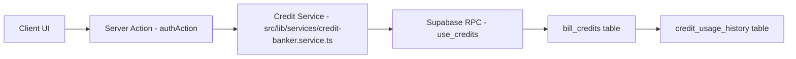

# 🔧 BACKEND WIRING STRATEGY - CitaTed (BlogSpy)

> **Last Updated:** 2026-02-05  
> **Status:** ACTIVE - Critical fixes in progress  
> **Author:** AI Architect + Backend Engineer (God Mode)

---

## 📊 Executive Summary

### Current State Analysis
| Metric | Status | Details |
|--------|--------|---------|
| **Features** | 37 | Full feature inventory in `src/features/` |
| **Server Actions** | 20+ | Distributed across features, some bypass `authAction` |
| **CRITICAL Issues** | 4 | Ship blockers requiring immediate fix |
| **WARNING Issues** | 6 | Tech debt to address before scale |
| **CLEAN Areas** | 3 | UI components, rate limiting, credit RPC |

### Priority Matrix

| Priority | Issue | Security Risk | Effort | ETA |
|----------|-------|---------------|--------|-----|
| P0 | Credits localStorage | 🔴 CRITICAL | 2h | Day 1 |
| P0 | API Routes Auth | 🔴 CRITICAL | 1h | Day 1 |
| P1 | GeoScore Formula | 🟡 Medium | 3h | Day 1-2 |
| P1 | Feature-local Credits | 🟡 Medium | 2h | Day 2 |
| P2 | Server-only Services | 🟢 Low | 1h | Day 2 |

---

## 🔴 CRITICAL FIXES (Ship Blockers)

### 1. Credits System Security (P0)

#### Problem
- `src/features/ai-writer/services/index.ts:240-252` uses `window.localStorage`
- `src/features/news-tracker/news-tracker-content.tsx:124-157` uses `localStorage`
- Users can manipulate credits via DevTools (F12 → Application → LocalStorage)

#### Solution Architecture


#### Implementation Steps
1. Remove all localStorage credit logic in AI Writer
2. Create server action: `src/features/ai-writer/actions/credit-actions.ts`
3. Wire UI to call server action for balance/deduction
4. Use existing `use_credits` RPC in Supabase

#### Files to Modify
- [ ] `src/features/ai-writer/services/index.ts` - Remove localStorage
- [ ] `src/features/ai-writer/actions/credit-actions.ts` - CREATE NEW
- [ ] `src/features/ai-writer/hooks/use-credits.ts` - Wire to server action
- [ ] `src/features/news-tracker/news-tracker-content.tsx` - Remove localStorage

#### Acceptance Criteria
- [ ] No `localStorage` references for credits in codebase
- [ ] All credit operations go through `authAction` wrapper
- [ ] Credit deductions logged in `credit_usage_history`

---

### 2. API Routes Authentication (P0)

#### Problem
- `src/features/video-hijack/api/youtube/route.ts` - No auth check
- `src/features/video-hijack/api/tiktok/route.ts` - No auth check

#### Solution
```typescript
// Pattern for all API routes
import { createClient } from "@/lib/supabase/server"
import { NextRequest, NextResponse } from "next/server"

export async function GET(request: NextRequest) {
  const supabase = await createClient()
  const { data: { user }, error } = await supabase.auth.getUser()
  
  if (error || !user) {
    return NextResponse.json({ error: "Unauthorized" }, { status: 401 })
  }
  
  // ... rest of handler
}
```

#### Files to Modify
- [ ] All files in `src/app/api/**/*.ts`
- [ ] All files in `src/features/*/api/**/*.ts`

---

### 3. GeoScore Formula Consolidation (P1)

#### Problem
Two different algorithms produce inconsistent scores:

**Formula A (Keyword Research):**
```
GEO = AI Overview (40pts) + Featured Snippet (30pts) + Intent (20pts) + Word Count (10pts)
```

**Formula B (AI Writer):**
```
GEO = Country/city string matching + content length heuristic
```

#### Solution
```
src/shared/
└── geo-score/
    ├── index.ts
    ├── calculator.ts      # Single canonical formula
    ├── types.ts
    └── constants.ts
```

#### Canonical Formula (Proposed)
```typescript
interface GeoScoreInput {
  hasAIOverview: boolean       // 25 pts
  hasFeaturedSnippet: boolean  // 20 pts
  hasKnowledgePanel: boolean   // 15 pts
  intent: 'informational' | 'navigational' | 'transactional' | 'commercial'  // 15 pts
  contentQuality: number       // 0-100, scaled to 15 pts
  sourceAuthority: number      // 0-100, scaled to 10 pts
}

function calculateGeoScore(input: GeoScoreInput): number {
  let score = 0
  
  // SERP Features (60 pts)
  if (input.hasAIOverview) score += 25
  if (input.hasFeaturedSnippet) score += 20
  if (input.hasKnowledgePanel) score += 15
  
  // Intent Alignment (15 pts)
  const intentScores = { informational: 15, navigational: 10, commercial: 12, transactional: 8 }
  score += intentScores[input.intent] || 0
  
  // Content Quality (15 pts)
  score += Math.round((input.contentQuality / 100) * 15)
  
  // Source Authority (10 pts)
  score += Math.round((input.sourceAuthority / 100) * 10)
  
  return Math.min(100, score)
}
```

---

### 4. Feature-Local Credit Systems (P1)

#### Problem
- `src/features/news-tracker/services/credit.service.ts` - In-memory credits
- `src/features/social-tracker/credits/services/balance.service.ts` - Mock store

#### Solution
Delete feature-local credit services and wire to canonical:
```
src/lib/services/credit-banker.service.ts (EXISTING - USE THIS)
```

---

## 🟡 WARNING FIXES (Tech Debt)

### 5. Add `server-only` to Services (P2)
Missing protection in:
- `src/features/snippet-stealer/services/snippet-stealer.service.ts`
- `src/features/schema-generator/services/schema.service.ts`
- `src/features/rank-tracker/services/rank-tracker.service.ts`
- `src/features/on-page-checker/services/on-page.service.ts`

### 6. Extend Middleware Protection (P2)
Current: Only `/dashboard/*` protected
Missing:
- `/ai-writer/*`
- `/keyword-magic/*`
- `/rank-tracker/*`
- All authenticated routes

---

## 🏗️ Backend Wiring Patterns

### Pattern 1: Server Actions with Auth
```typescript
// src/features/[feature]/actions/[action-name].ts
"use server"

import { authAction } from "@/lib/safe-action"
import { z } from "zod"

const inputSchema = z.object({
  // Define input shape
})

export const myAction = authAction
  .schema(inputSchema)
  .action(async ({ parsedInput, ctx }) => {
    const { userId } = ctx
    // Action logic here
  })
```

### Pattern 2: Database Operations
```typescript
// Always use DAL for user operations
import { getCurrentUser } from "@/lib/dal"
import { prisma } from "@/lib/prisma"

// For mutations with credits
import { creditBankerService } from "@/lib/services/credit-banker.service"
```

### Pattern 3: External API Calls
```typescript
// Charge credits BEFORE external call (prevent race conditions)
const creditResult = await creditBankerService.useCredits({
  userId,
  amount: OPERATION_COST,
  featureName: "ai-writer",
  description: "Article generation"
})

if (!creditResult.success) {
  throw new Error("Insufficient credits")
}

// THEN make external call
const apiResult = await externalApiCall()
```

---

## 📁 File Structure Standards

```
src/features/[feature-name]/
├── index.ts              # Public exports
├── [feature]-content.tsx # Main content component
├── actions/              # Server actions (authAction wrapped)
│   ├── index.ts
│   └── [action-name].ts
├── components/           # UI components
├── hooks/                # Client hooks (React Query)
├── services/             # Server-only services
│   └── index.ts          # Must have `import "server-only"`
├── types/                # TypeScript types
└── utils/                # Pure utility functions
```

---

## 🔐 Security Checklist

- [ ] All server actions use `authAction` or `adminAction`
- [ ] No `localStorage` for sensitive data (credits, tokens)
- [ ] All API routes check authentication
- [ ] All services have `import "server-only"`
- [ ] Rate limiting on expensive operations
- [ ] Input validation with Zod on all actions
- [ ] RLS policies active on all Supabase tables

---

## 📅 Execution Timeline

### Day 1 (TODAY)
- [ ] Fix AI Writer localStorage credits
- [ ] Fix API route authentication
- [ ] Create shared GeoScore module

### Day 2
- [ ] Wire news-tracker/social-tracker to canonical credits
- [ ] Add server-only to all services
- [ ] Extend middleware protection

### Day 3
- [ ] Run full security audit
- [ ] `npm run build` verification
- [ ] Integration testing

---

## ✅ Definition of Done

1. `npm run build` passes with zero errors
2. No `localStorage` references for credits
3. All API routes return 401 for unauthenticated requests
4. Single `calculateGeoScore()` function used everywhere
5. All services have `server-only` import
6. All server actions use `authAction` wrapper

---

*Document maintained by AI Assistant. Update after each major change.*
