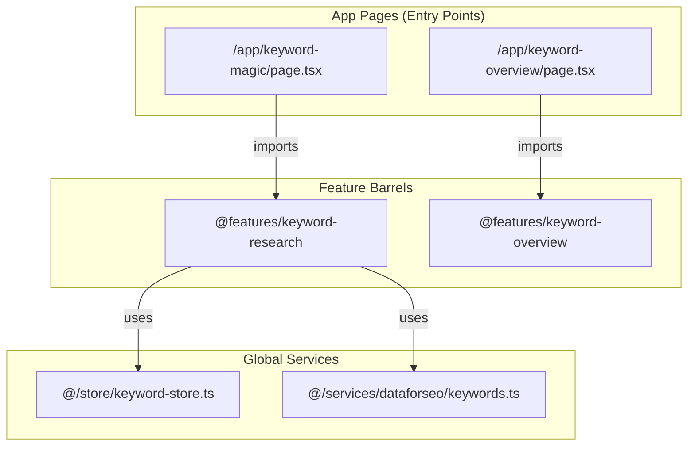
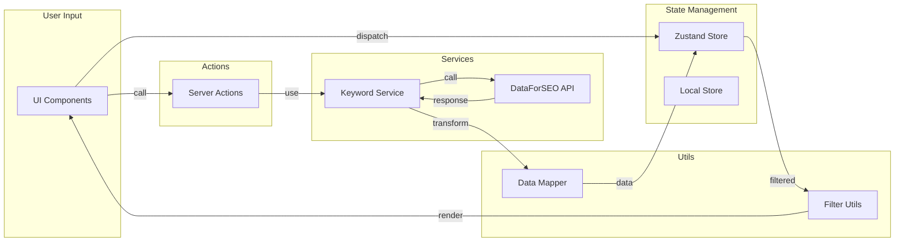

# 🗂️ Keyword Explorer Feature - Complete A-Z Tree Structure

> Complete file/folder structure with import/export connections for the Keyword Explorer (Keyword Magic) feature.

---

## 📁 Complete Directory Tree

```
src/
├── app/
│   ├── keyword-magic/
│   │   └── page.tsx                          # Public Demo Page
│   └── keyword-overview/
│       └── page.tsx                          # Keyword Overview Page
│
├── features/
│   ├── keyword-research/                     # 🔥 MAIN FEATURE (141 files)
│   │   ├── index.ts                          # Feature Barrel Export
│   │   ├── keyword-research-content.tsx      # Main Content Component
│   │   ├── README.md
│   │   │
│   │   ├── __mocks__/
│   │   │   ├── index.ts
│   │   │   └── keyword-data.ts               # Mock Data for Testing
│   │   │
│   │   ├── actions/                          # Server Actions
│   │   │   ├── index.ts
│   │   │   ├── fetch-drawer-data.ts
│   │   │   ├── fetch-keywords.ts
│   │   │   └── refresh-keyword.ts
│   │   │
│   │   ├── components/                       # UI Components (93 files)
│   │   │   ├── index.ts                      # Component Barrel Export
│   │   │   │
│   │   │   ├── drawers/                      # Drawer Components
│   │   │   │   ├── index.ts
│   │   │   │   ├── KeywordDetailsDrawer.tsx
│   │   │   │   ├── KeywordDrawer.tsx
│   │   │   │   ├── OverviewTab.tsx
│   │   │   │   ├── CommerceTab.tsx
│   │   │   │   ├── SocialTab.tsx
│   │   │   │   ├── RtvBreakdownWidget.tsx
│   │   │   │   ├── RtvFormulaDialog.tsx
│   │   │   │   ├── RtvWidget.tsx
│   │   │   │   ├── YouTubeStrategyPanel.tsx
│   │   │   │   └── widgets/
│   │   │   │       ├── RtvBreakdown.tsx
│   │   │   │       └── RtvFormulaButton.tsx
│   │   │   │
│   │   │   ├── filters/                      # Filter Components (22 files)
│   │   │   │   ├── index.ts
│   │   │   │   ├── FilterBar.tsx
│   │   │   │   ├── cpc/
│   │   │   │   │   ├── index.ts
│   │   │   │   │   └── cpc-filter.tsx
│   │   │   │   ├── geo/
│   │   │   │   │   ├── index.ts
│   │   │   │   │   └── geo-filter.tsx
│   │   │   │   ├── include-exclude/
│   │   │   │   │   ├── index.ts
│   │   │   │   │   └── include-exclude-filter.tsx
│   │   │   │   ├── intent/
│   │   │   │   │   ├── index.ts
│   │   │   │   │   └── intent-filter.tsx
│   │   │   │   ├── kd/
│   │   │   │   │   ├── index.ts
│   │   │   │   │   └── kd-filter.tsx
│   │   │   │   ├── match-type/
│   │   │   │   │   ├── index.ts
│   │   │   │   │   └── match-type-toggle.tsx
│   │   │   │   ├── serp/
│   │   │   │   │   ├── index.ts
│   │   │   │   │   └── serp-filter.tsx
│   │   │   │   ├── trend/
│   │   │   │   │   ├── index.ts
│   │   │   │   │   └── trend-filter.tsx
│   │   │   │   ├── volume/
│   │   │   │   │   ├── index.ts
│   │   │   │   │   └── volume-filter.tsx
│   │   │   │   └── weak-spot/
│   │   │   │       ├── index.ts
│   │   │   │       └── weak-spot-filter.tsx
│   │   │   │
│   │   │   ├── header/
│   │   │   │   ├── index.ts
│   │   │   │   ├── CreditBalance.tsx
│   │   │   │   ├── country-selector.tsx
│   │   │   │   ├── page-header.tsx
│   │   │   │   └── results-header.tsx
│   │   │   │
│   │   │   ├── modals/
│   │   │   │   ├── index.ts
│   │   │   │   ├── export-modal.tsx
│   │   │   │   ├── filter-presets-modal.tsx
│   │   │   │   └── keyword-details-modal.tsx
│   │   │   │
│   │   │   ├── page-sections/
│   │   │   │   ├── index.ts
│   │   │   │   ├── KeywordResearchFilters.tsx
│   │   │   │   ├── KeywordResearchHeader.tsx
│   │   │   │   ├── KeywordResearchResults.tsx
│   │   │   │   └── KeywordResearchSearch.tsx
│   │   │   │
│   │   │   ├── search/
│   │   │   │   ├── index.ts
│   │   │   │   ├── bulk-keywords-input.tsx
│   │   │   │   ├── bulk-mode-toggle.tsx
│   │   │   │   ├── keyword-search-form.tsx
│   │   │   │   ├── search-input.tsx
│   │   │   │   └── search-suggestions.tsx
│   │   │   │
│   │   │   ├── shared/
│   │   │   │   ├── index.tsx
│   │   │   │   ├── empty-states.tsx
│   │   │   │   ├── error-boundary.tsx
│   │   │   │   └── loading-skeleton.tsx
│   │   │   │
│   │   │   └── table/                        # Table Components (34 files)
│   │   │       ├── index.ts
│   │   │       ├── KeywordTable.tsx
│   │   │       ├── KeywordTableFooter.tsx
│   │   │       │
│   │   │       ├── action-bar/
│   │   │       │   ├── index.ts
│   │   │       │   ├── action-bar.tsx
│   │   │       │   ├── bulk-actions.tsx
│   │   │       │   └── selection-info.tsx
│   │   │       │
│   │   │       └── columns/                  # Column Components
│   │   │           ├── index.ts
│   │   │           ├── columns.tsx
│   │   │           ├── actions/
│   │   │           │   ├── index.ts
│   │   │           │   └── actions-column.tsx
│   │   │           ├── checkbox/
│   │   │           │   ├── index.ts
│   │   │           │   └── checkbox-column.tsx
│   │   │           ├── cpc/
│   │   │           │   ├── index.ts
│   │   │           │   └── cpc-column.tsx
│   │   │           ├── geo/
│   │   │           │   ├── index.ts
│   │   │           │   └── geo-column.tsx
│   │   │           ├── intent/
│   │   │           │   ├── index.ts
│   │   │           │   └── intent-column.tsx
│   │   │           ├── kd/
│   │   │           │   ├── index.ts
│   │   │           │   └── kd-column.tsx
│   │   │           ├── keyword/
│   │   │           │   ├── index.ts
│   │   │           │   └── keyword-column.tsx
│   │   │           ├── refresh/
│   │   │           │   ├── index.ts
│   │   │           │   ├── RefreshCreditsHeader.tsx
│   │   │           │   └── refresh-column.tsx
│   │   │           ├── serp/
│   │   │           │   ├── index.ts
│   │   │           │   └── serp-column.tsx
│   │   │           ├── trend/
│   │   │           │   ├── index.ts
│   │   │           │   └── trend-column.tsx
│   │   │           ├── volume/
│   │   │           │   ├── index.ts
│   │   │           │   └── volume-column.tsx
│   │   │           └── weak-spot/
│   │   │               ├── index.ts
│   │   │               └── weak-spot-column.tsx
│   │   │
│   │   ├── config/
│   │   │   ├── index.ts
│   │   │   ├── api-config.ts
│   │   │   └── feature-config.ts
│   │   │
│   │   ├── constants/
│   │   │   ├── index.ts
│   │   │   └── table-config.ts
│   │   │
│   │   ├── data/
│   │   │   ├── index.ts
│   │   │   └── mock-keywords.ts
│   │   │
│   │   ├── hooks/
│   │   │   ├── index.ts
│   │   │   └── use-keywords.ts
│   │   │
│   │   ├── providers/
│   │   │   └── index.ts                      # Legacy (uses Zustand now)
│   │   │
│   │   ├── services/                         # API Services (10 files)
│   │   │   ├── index.ts
│   │   │   ├── api-base.ts
│   │   │   ├── bulk-analysis.service.ts
│   │   │   ├── export.service.ts
│   │   │   ├── keyword-discovery.ts
│   │   │   ├── keyword.service.ts
│   │   │   ├── live-serp.ts
│   │   │   ├── mock-utils.ts
│   │   │   ├── social.service.ts
│   │   │   └── suggestions.service.ts
│   │   │
│   │   ├── store/
│   │   │   └── index.ts                      # Zustand Store (Feature-Local)
│   │   │
│   │   ├── types/
│   │   │   ├── index.ts
│   │   │   ├── api.types.ts
│   │   │   └── legacy-keyword.types.ts
│   │   │
│   │   └── utils/                            # Utility Functions (15 files)
│   │       ├── index.ts
│   │       ├── country-normalizer.ts
│   │       ├── data-mapper.ts
│   │       ├── export-utils.ts
│   │       ├── filter-utils.ts
│   │       ├── geo-calculator.ts
│   │       ├── mock-helpers.ts
│   │       ├── reddit-scoring.ts
│   │       ├── rtv-calculator.ts
│   │       ├── serp-feature-normalizer.ts
│   │       ├── serp-parser.ts
│   │       ├── sort-utils.ts
│   │       ├── weak-spot-detector.ts
│   │       ├── youtube-intelligence.ts
│   │       └── youtube-virality.ts
│   │
│   └── keyword-overview/                     # 🔷 OVERVIEW FEATURE (18 files)
│       ├── index.ts                          # Feature Barrel Export
│       ├── keyword-overview-content.tsx      # Main Content Component
│       │
│       ├── __mocks__/
│       │   └── keyword-data.ts
│       │
│       ├── components/                       # 12 Components
│       │   ├── index.ts
│       │   ├── ai-overview-section.tsx
│       │   ├── analysis-sections.tsx
│       │   ├── keyword-header.tsx
│       │   ├── keyword-overview-skeleton.tsx
│       │   ├── metric-cards.tsx
│       │   ├── radar-chart.tsx
│       │   ├── search-trends-card.tsx
│       │   ├── seasonality-chart.tsx
│       │   ├── serp-table.tsx
│       │   ├── trend-area-chart.tsx
│       │   └── world-map.tsx
│       │
│       ├── constants/
│       │   └── index.ts
│       │
│       ├── types/
│       │   └── index.ts
│       │
│       └── utils/
│           └── overview-utils.ts
│
├── store/
│   └── keyword-store.ts                      # 🌐 Global Zustand Store
│
└── services/
    └── dataforseo/
        └── keywords.ts                       # 🔌 DataForSEO Keywords API
```

---

## 🔗 Import/Export Connection Map

### 📦 Feature Entry Points



---

### 🎯 keyword-research Feature Connections

#### Main Entry Point: `index.ts`

| Export Category | Exports From | Key Exports |
|----------------|--------------|-------------|
| **Main Component** | `./keyword-research-content` | `KeywordResearchContent` |
| **Types** | `./types` | `Keyword`, `Country`, `FilterState`, `APIKeyword`, etc. |
| **Constants** | `./constants` | `POPULAR_COUNTRIES`, `ALL_COUNTRIES`, `KD_LEVELS`, etc. |
| **Utils** | `./utils` | `applyAllFilters`, `formatVolume`, `formatCPC`, `filterByKD`, etc. |
| **Config** | `./config` | `FEATURE_CONFIG`, `keywordMagicApiConfig`, `getEndpoint` |
| **Store (Zustand)** | `./store` | `useKeywordStore`, selectors |
| **Components** | `./components` | 40+ UI components |

---

#### Component Import Chain

```
keyword-research-content.tsx
    ├── imports from ./components
    │   ├── KeywordResearchHeader
    │   ├── KeywordResearchSearch
    │   ├── KeywordResearchFilters
    │   └── KeywordResearchResults
    │
    ├── imports from ./store
    │   └── useKeywordStore
    │
    └── imports from ./hooks
        └── useKeywords
```

---

### 📊 Components Barrel (`components/index.ts`) Exports

| Category | Components |
|----------|------------|
| **Filters** | `VolumeFilter`, `KDFilter`, `IntentFilter`, `CPCFilter`, `GeoFilter`, `WeakSpotFilter`, `SerpFilter`, `TrendFilter`, `IncludeExcludeFilter`, `MatchTypeToggle` |
| **Header** | `CountrySelector`, `PageHeader`, `ResultsHeader` |
| **Search** | `BulkModeToggle`, `BulkKeywordsInput`, `SearchInput`, `SearchSuggestions` |
| **Table** | `KeywordTable`, `KeywordTableFooter`, `ActionBar`, `BulkActions`, `SelectionInfo` |
| **Columns** | `CheckboxColumn`, `CheckboxHeader`, `KeywordColumn`, `VolumeColumn`, `KdColumn`, `CpcColumn`, `IntentColumn`, `TrendColumn`, `SerpColumn`, `GeoColumn`, `WeakSpotColumn`, `RefreshColumn`, `ActionsColumn` |
| **Drawers** | `KeywordDetailsDrawer`, `KeywordDrawer`, `OverviewTab`, `CommerceTab`, `SocialTab` |
| **Modals** | `ExportModal`, `FilterPresetsModal`, `KeywordDetailsModal` |
| **Page Sections** | `KeywordResearchHeader`, `KeywordResearchSearch`, `KeywordResearchFilters`, `KeywordResearchResults` |
| **Shared** | `EmptyState`, `NoSearchState`, `NoResultsState`, `ErrorState`, `ErrorBoundary`, `LoadingSkeleton` |

---

### 🎯 keyword-overview Feature Connections

#### Main Entry Point: `index.ts`

| Export Category | Exports From | Key Exports |
|----------------|--------------|-------------|
| **Main Component** | `./keyword-overview-content` | `KeywordOverviewContent` |
| **Components** | `./components` | `SERPTable`, `KeywordHeader`, `SearchTrendsCard`, `AIOverviewSection`, Charts |
| **Types** | `./types` | `DeviceView`, `KeywordMetrics`, `SERPResult`, `GlobalVolumeData` |
| **Constants** | `./constants` | `CHART_DIMENSIONS`, `KD_THRESHOLDS`, `DA_THRESHOLDS` |
| **Utils** | `./utils/overview-utils` | `getDAColorClass`, `getTypeBadgeClasses`, `getPixelRankMessage`, etc. |

---

### 🌐 Global Store Connection

```
src/store/keyword-store.ts
    ├── imports from zustand
    │   └── create
    │
    └── imports from @features/keyword-research/types
        ├── Keyword
        └── KeywordSortOptions
```

---

### 🔌 DataForSEO Service Connection

```
src/services/dataforseo/keywords.ts
    ├── imports from ./client
    │   ├── dataForSEOClient
    │   └── type ApiResponse
    │
    └── imports from @/constants/api-endpoints
        └── DATAFORSEO

    exports:
        ├── getSearchVolume()
        ├── getKeywordSuggestions()
        ├── getKeywordsForSite()
        ├── getRelatedKeywords()
        └── keywordsApi (all methods bundled)
```

---

## 📁 App Pages Import Details

### `/app/keyword-magic/page.tsx`

```typescript
import { Suspense } from "react"
import { KeywordResearchContent } from "@features/keyword-research"
import { DemoWrapper } from "@/components/shared/common/demo-wrapper"
```

### `/app/keyword-overview/page.tsx`

```typescript
import { KeywordOverviewContent } from "@features/keyword-overview"
```

---

## 📈 File Count Summary

| Folder | Files | Description |
|--------|-------|-------------|
| `keyword-research/` | **141** | Main keyword research feature |
| `keyword-research/components/` | 93 | UI components |
| `keyword-research/components/table/columns/` | 27 | Table column components |
| `keyword-research/components/filters/` | 22 | Filter components |
| `keyword-research/services/` | 10 | API services |
| `keyword-research/utils/` | 15 | Utility functions |
| `keyword-overview/` | **18** | Keyword overview feature |
| `keyword-overview/components/` | 12 | Overview UI components |

---

## 🔄 Data Flow



---

> ⚠️ **Note**: This document is read-only analysis. No code changes were made.
> 📅 Generated: 2026-01-21
