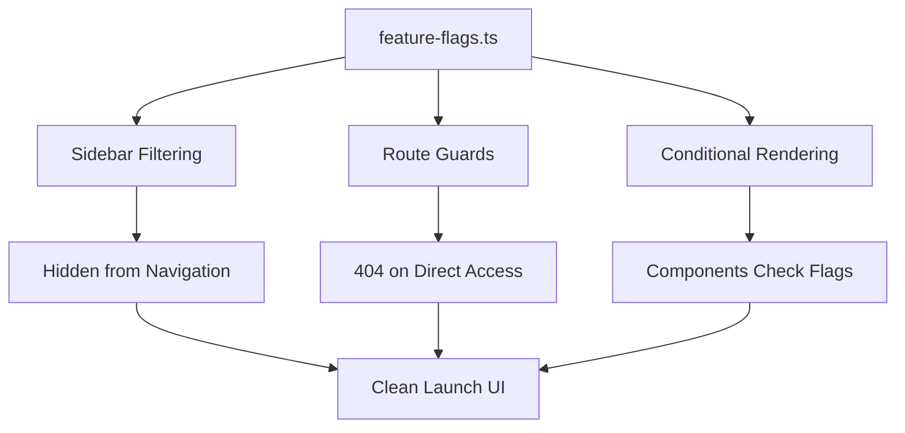

# 🚀 FEATURE FLAG IMPLEMENTATION PLAN

## 📋 OBJECTIVE
Implement a robust feature flagging system to hide 10 incomplete/beta features from Phase 1 launch WITHOUT deleting any code.

---

## 🏗️ ARCHITECTURE OVERVIEW



---

## 📊 FEATURE FLAG MAPPING

### ✅ **ENABLED (18 Features)**

**Core MVP:**
- `KEYWORD_RESEARCH` - Keyword Magic tool
- `COMPETITOR_GAP` - Gap analysis
- `TREND_SPOTTER` - Trend detection
- `KEYWORD_OVERVIEW` - Deep dive forensics
- `AI_WRITER` - SEO content editor
- `SNIPPET_STEALER` - Featured snippet optimizer
- `RANK_TRACKER` - Position tracking
- `CONTENT_DECAY` - Traffic loss monitoring
- `CANNIBALIZATION` - Duplicate content detector
- `TOPIC_CLUSTERS` - Content clustering
- `CONTENT_ROADMAP` - Kanban workflow
- `COMMAND_PALETTE` - Quick navigation

**Infrastructure:**
- `SETTINGS` - User management
- `INTEGRATIONS` - GSC/GA4 connectivity
- `NOTIFICATIONS` - Alert system
- `SCHEMA_GENERATOR` - JSON-LD tool
- `ON_PAGE_CHECKER` - SEO audit
- `CONTENT_CALENDAR` - Editorial planning

### ❌ **DISABLED (10 Features)**

**Beta/Incomplete:**
- `VIDEO_HIJACK` - YouTube/TikTok opportunities (beta)
- `AFFILIATE_FINDER` - Commission keywords (niche)
- `NEWS_TRACKER` - Google News tracking (testing)
- `SOCIAL_TRACKER` - Multi-platform tracking (complexity)
- `COMMERCE_TRACKER` - E-commerce keywords (limited TAM)
- `COMMUNITY_TRACKER` - Forum monitoring (redundant)
- `CONTENT_ROI` - Revenue attribution (needs analytics)
- `MONETIZATION_CALC` - Earnings calculator (education)
- `AI_VISIBILITY` - AI citation tracking (emerging)
- `CITATION_CHECKER` - Citation monitoring (overlaps)

---

## 🔧 IMPLEMENTATION STEPS

### **Step 1: Create Feature Flags Config**
**File:** `src/config/feature-flags.ts`

```typescript
/**
 * Feature Flags Configuration
 * Control which features are visible/accessible in production
 * 
 * Usage:
 * - Sidebar: Filter navigation items
 * - Routes: Guard page access with notFound()
 * - Components: Conditional rendering
 */

export const FEATURE_FLAGS = {
  // ============================================
  // ✅ ENABLED - CORE MVP (Phase 1)
  // ============================================
  
  // Research Tools
  KEYWORD_RESEARCH: true,
  COMPETITOR_GAP: true,
  TREND_SPOTTER: true,
  KEYWORD_OVERVIEW: true,
  
  // Creation Tools
  AI_WRITER: true,
  SNIPPET_STEALER: true,
  
  // Tracking Tools
  RANK_TRACKER: true,
  CONTENT_DECAY: true,
  CANNIBALIZATION: true,
  
  // Strategy Tools
  TOPIC_CLUSTERS: true,
  CONTENT_ROADMAP: true,
  
  // Infrastructure
  SETTINGS: true,
  INTEGRATIONS: true,
  NOTIFICATIONS: true,
  SCHEMA_GENERATOR: true,
  ON_PAGE_CHECKER: true,
  CONTENT_CALENDAR: true,
  COMMAND_PALETTE: true,
  
  // ============================================
  // ❌ DISABLED - BETA/PHASE 2 (Hidden)
  // ============================================
  
  VIDEO_HIJACK: false,
  AFFILIATE_FINDER: false,
  NEWS_TRACKER: false,
  SOCIAL_TRACKER: false,
  COMMERCE_TRACKER: false,
  COMMUNITY_TRACKER: false,
  CONTENT_ROI: false,
  MONETIZATION_CALC: false,
  AI_VISIBILITY: false,
  CITATION_CHECKER: false,
} as const;

// Type-safe feature flag keys
export type FeatureFlag = keyof typeof FEATURE_FLAGS;

// Helper function to check if feature is enabled
export function isFeatureEnabled(feature: FeatureFlag): boolean {
  return FEATURE_FLAGS[feature];
}
```

---

### **Step 2: Update Sidebar Navigation**
**File:** `components/layout/app-sidebar.tsx`

**Changes Required:**
1. Import `FEATURE_FLAGS` at top
2. Add `featureFlag` property to each navigation item
3. Filter arrays based on flags before rendering

**Example:**
```typescript
import { FEATURE_FLAGS } from '@/src/config/feature-flags';

const researchItems = [
  { 
    title: "Keyword Explorer", 
    icon: Search, 
    href: "/dashboard/research/keyword-magic",
    featureFlag: "KEYWORD_RESEARCH"
  },
  { 
    title: "Trend Spotter", 
    icon: Flame, 
    href: "/dashboard/research/trends",
    featureFlag: "TREND_SPOTTER"
  },
  { 
    title: "Affiliate Finder", 
    icon: ShoppingCart, 
    href: "/dashboard/research/affiliate-finder",
    featureFlag: "AFFILIATE_FINDER" // ❌ Will be filtered out
  },
  // ... more items
].filter(item => !item.featureFlag || FEATURE_FLAGS[item.featureFlag]);
```

---

### **Step 3: Add Route Guards**
**Target Pages (10 files):**

1. `app/dashboard/research/affiliate-finder/page.tsx`
2. `app/dashboard/research/video-hijack/page.tsx`
3. `app/dashboard/tracking/news-tracker/page.tsx`
4. `app/dashboard/tracking/community-tracker/page.tsx`
5. `app/dashboard/tracking/social-tracker/page.tsx`
6. `app/dashboard/tracking/commerce-tracker/page.tsx`
7. `app/dashboard/tracking/ai-visibility/page.tsx`
8. `app/dashboard/research/citation-checker/page.tsx` (if exists)
9. `app/dashboard/monetization/content-roi/page.tsx` (if exists)
10. `app/dashboard/monetization/earnings-calculator/page.tsx` (if exists)

**Guard Pattern:**
```typescript
import { FEATURE_FLAGS } from "@/src/config/feature-flags";
import { notFound } from "next/navigation";

export default function NewsTrackerPage() {
  // Feature flag guard - returns 404 if disabled
  if (!FEATURE_FLAGS.NEWS_TRACKER) {
    return notFound();
  }
  
  // Original page content
  return (
    <SidebarProvider>
      <AppSidebar />
      <SidebarInset>
        {/* ... existing content */}
      </SidebarInset>
    </SidebarProvider>
  );
}
```

---

## 🎯 IMPLEMENTATION CHECKLIST

### **Phase 1: Config & Core** (3 tasks)
- [ ] Create `src/config/feature-flags.ts` with all 28 feature flags
- [ ] Add TypeScript types for type-safe access
- [ ] Add helper function `isFeatureEnabled()`

### **Phase 2: Sidebar Update** (1 task)
- [ ] Update `components/layout/app-sidebar.tsx`:
  - Add `featureFlag` property to all navigation arrays
  - Filter items based on `FEATURE_FLAGS`
  - Test that disabled features don't appear

### **Phase 3: Route Guards** (10 tasks)
Add `notFound()` guards to:
- [ ] `app/dashboard/research/affiliate-finder/page.tsx`
- [ ] `app/dashboard/research/video-hijack/page.tsx`
- [ ] `app/dashboard/tracking/news-tracker/page.tsx`
- [ ] `app/dashboard/tracking/community-tracker/page.tsx`
- [ ] `app/dashboard/tracking/social-tracker/page.tsx`
- [ ] `app/dashboard/tracking/commerce-tracker/page.tsx`
- [ ] `app/dashboard/tracking/ai-visibility/page.tsx`
- [ ] Search for monetization pages and guard if they exist

### **Phase 4: Build & Test** (3 tasks)
- [ ] Run `npm run build` - verify no compilation errors
- [ ] Manual test: Check sidebar shows only 18 features
- [ ] Manual test: Direct URL access to disabled features returns 404

---

## 🧪 TESTING STRATEGY

### **Sidebar Tests:**
1. Navigate to `/dashboard`
2. Verify sidebar shows:
   - ✅ Research (4 items) - NO Affiliate Finder, Video Hijack
   - ✅ Strategy (2 items)
   - ✅ Creation (4 items)
   - ✅ Tracking (3 items) - NO News/Social/Commerce/Community
3. Count total visible items = 18

### **Route Guard Tests:**
1. Attempt to visit `/dashboard/research/affiliate-finder`
   - Expected: 404 page
2. Attempt to visit `/dashboard/tracking/news-tracker`
   - Expected: 404 page
3. Attempt to visit `/dashboard/tracking/social-tracker`
   - Expected: 404 page
4. Verify enabled pages still work:
   - `/dashboard/research/keyword-magic` - ✅ Works
   - `/dashboard/tracking/rank-tracker` - ✅ Works

### **Build Tests:**
```bash
# Clean build test
npm run build

# Expected output:
# ✓ Compiled successfully
# No TypeScript errors
# All routes generated
```

---

## ⚠️ CRITICAL CONSIDERATIONS

### **No Code Deletion**
- ✅ All 28 feature folders remain in `src/features/`
- ✅ All page files remain in `app/dashboard/`
- ✅ All imports/exports intact
- ✅ Only behavior changes via flags

### **Type Safety**
- Use `as const` for feature flags
- Export `FeatureFlag` type for compile-time checking
- IDE autocomplete for flag names

### **Future Enablement**
To enable a feature later:
1. Change flag from `false` to `true` in `feature-flags.ts`
2. Rebuild: `npm run build`
3. Deploy - feature appears immediately

### **Environment-Based Flags** (Future Enhancement)
```typescript
// Optional: Environment-specific overrides
const isProduction = process.env.NODE_ENV === 'production';

export const FEATURE_FLAGS = {
  VIDEO_HIJACK: isProduction ? false : true, // Dev only
  // ...
}
```

---

## 📐 ARCHITECTURE BENEFITS

✅ **Single Source of Truth** - One config file controls everything
✅ **Type-Safe** - TypeScript prevents typos
✅ **Zero Code Deletion** - All features preserved
✅ **Easy Rollback** - Change flag back to true
✅ **Phased Rollout** - Enable features gradually
✅ **A/B Testing Ready** - Can tie flags to user segments later
✅ **Build-Time Optimization** - Tree-shaking possible

---

## 🚀 DEPLOYMENT CHECKLIST

### **Pre-Deploy:**
- [ ] All 10 route guards added
- [ ] Sidebar filtering working
- [ ] Build passes without errors
- [ ] Manual testing completed

### **Deploy:**
- [ ] Push to staging
- [ ] QA smoke test all 18 enabled features
- [ ] Verify 10 disabled features return 404
- [ ] Push to production

### **Post-Deploy:**
- [ ] Monitor error logs for 404s
- [ ] Check analytics for unexpected 404 hits
- [ ] User feedback collection

---

## 📊 EXPECTED OUTCOMES

### **Before Implementation:**
- Sidebar shows 28 features (cluttered)
- Some features incomplete/broken
- Support burden high

### **After Implementation:**
- Sidebar shows 18 polished features
- All visible features work perfectly
- Clean, professional launch
- Room for "new feature" announcements

---

## 🎯 SUCCESS CRITERIA

✅ Build completes without errors
✅ Sidebar shows exactly 18 features
✅ 10 disabled features return 404
✅ No console errors in browser
✅ All enabled features functional
✅ Codebase intact (no deletions)

---

## 📝 NEXT STEPS

1. **Review this plan** - Any changes needed?
2. **Approve implementation** - Ready to proceed?
3. **Switch to Code mode** - Execute the plan
4. **Test thoroughly** - Verify all guards work
5. **Deploy to staging** - Final QA before production

---

**Ready to implement?** 🚀
