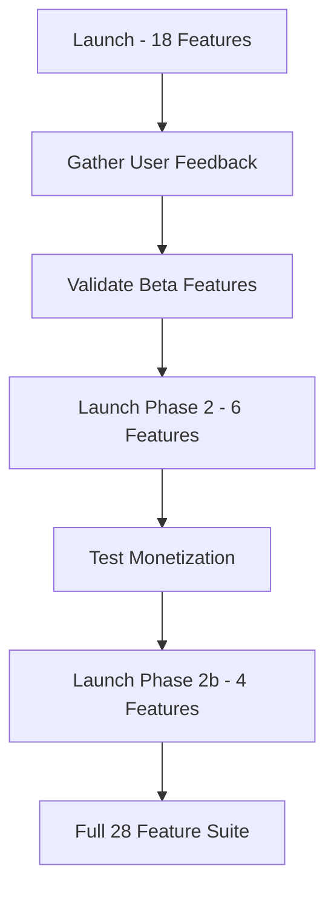

# 🚀 BLOGSPY FEATURE LAUNCH STRATEGY

## 📋 COMPLETE FEATURE CATEGORIZATION (All 28 Features)

---

## ✅ **PHASE 1: LAUNCH READY (Core MVP - 12 Features)**
*Production-ready, essential for launch*

### **🔍 RESEARCH (4 Features)**
1. ✅ **Keyword Research** - Core product, PLG ready, must-have
2. ✅ **Competitor Gap** - Key differentiator, battle-tested
3. ✅ **Trend Spotter** - Unique selling point, viral potential
4. ✅ **Keyword Overview** - Deep dive forensics, premium feature

### **✍️ CREATION (2 Features)**
5. ✅ **AI Writer** - Revenue driver, integrates with other features
6. ✅ **Snippet Stealer** - Quick wins, user engagement

### **📊 TRACKING (3 Features)**
7. ✅ **Rank Tracker** - Essential SEO tool, sticky feature
8. ✅ **Content Decay** - Unique, alert-driven retention
9. ✅ **Cannibalization** - Problem solver, technical depth

### **🗺️ STRATEGY (2 Features)**
10. ✅ **Topic Clusters** - Visual impact, enterprise appeal
11. ✅ **Content Roadmap** - Workflow tool, retention driver

### **🔧 CORE SYSTEMS (1 Feature)**
12. ✅ **Command Palette** - UX enhancement, power user feature

---

## ⏸️ **PHASE 2: DISABLE FOR NOW (10 Features)**
*Beta/incomplete, can be launched later*

### **🧪 BETA FEATURES (Not Fully Integrated)**
13. ⏸️ **Video Hijack** - Beta stage, API integration pending
14. ⏸️ **Affiliate Finder** - Niche use case, limited appeal
15. ⏸️ **News Tracker** - Credit system needs testing
16. ⏸️ **Social Tracker** - Credit system, multi-platform complexity
17. ⏸️ **Commerce Tracker** - E-commerce only, limited TAM
18. ⏸️ **Community Tracker** - Forum monitoring, overlaps with Gap Analysis

### **💰 MONETIZATION (Phase 2 Launch)**
19. ⏸️ **Content ROI Tracker** - UNIQUE but needs analytics integration
20. ⏸️ **Monetization Calculator** - UNIQUE but education needed

### **🔍 ADVANCED TRACKING**
21. ⏸️ **AI Visibility** - Emerging space, citation tracking complex
22. ⏸️ **Citation Checker** - AI-specific, overlaps with AI Visibility

---

## ⚙️ **PHASE 3: SUPPORTING FEATURES (6 Features)**
*Always active, infrastructure/utility*

### **🛠️ INFRASTRUCTURE (Keep Active)**
23. ✅ **Settings & User Management** - Core system, always on
24. ✅ **Integrations (GSC/GA4)** - Data connectivity, essential
25. ✅ **Notifications System** - Engagement driver, retention
26. ✅ **Schema Generator** - Utility tool, lightweight
27. ✅ **On-Page Checker** - SEO basics, complement to AI Writer
28. ✅ **Content Calendar** - Workflow utility, planning tool

---

## 📊 **SUMMARY BY STATUS**

| Status | Count | Purpose |
|--------|-------|---------|
| **✅ Launch (Phase 1)** | 12 | Core MVP, revenue drivers |
| **⏸️ Disable Now (Phase 2)** | 10 | Beta, niche, needs work |
| **✅ Keep Active (Phase 3)** | 6 | Infrastructure, utilities |
| **TOTAL** | **28** | All features accounted |

---

## 🎯 **RECOMMENDATION**

### **LAUNCH WITH: 18 Features**
- 12 Core MVP (Phase 1)
- 6 Supporting/Infrastructure (Phase 3)

### **DISABLE: 10 Features**
- Video Hijack (beta)
- Affiliate Finder (niche)
- News Tracker (testing needed)
- Social Tracker (complexity)
- Commerce Tracker (limited TAM)
- Community Tracker (redundant)
- Content ROI (needs analytics)
- Monetization Calculator (education)
- AI Visibility (emerging)
- Citation Checker (overlaps)

---

## 💡 **BUSINESS RATIONALE**

### **Why Launch These 18?**
✅ **Proven value** - Users understand the problem
✅ **Fully functional** - No API dependencies blocking
✅ **Differentiated** - Unique to BlogSpy
✅ **Revenue ready** - Can monetize immediately
✅ **Sticky features** - Drive retention

### **Why Disable These 10?**
⏸️ **Beta quality** - Need more testing
⏸️ **Complex integrations** - API costs unclear
⏸️ **Narrow audience** - Not all users need
⏸️ **Education required** - Users don't know they need it yet
⏸️ **Overlapping** - Similar to other features

---

## 🔄 **PHASED ROLLOUT STRATEGY**

### **Timeline Suggestion:**
- **Month 1-2:** Launch with 18 core features
- **Month 3:** Beta test Video Hijack, Social Tracker
- **Month 4:** Launch Monetization features (ROI, Calculator)
- **Month 5:** Launch AI Visibility suite
- **Month 6:** Full 28 feature suite

---

## ⚠️ **IMPLEMENTATION NOTES**

1. **No Code Deletion** - All 28 features stay in codebase
2. **Feature Flags** - Control via `config/site.config.ts`
3. **Sidebar Filtering** - Hide disabled features from navigation
4. **Route Guards** - Block direct URL access
5. **Pricing Tiers** - Some Phase 2 features can be "Pro only"

---

## 🎨 **SIDEBAR ORGANIZATION (18 Features)**

**Dashboard** (1)
- Command Center

**🤖 AI Insights** (0 for now - Phase 2)

**Research** (4)
- Keyword Explorer
- Trend Spotter  
- Competitor Gap
- Keyword Overview (new route needed)

**Strategy** (2)
- Topic Clusters
- Content Roadmap

**Creation** (4)
- AI Writer
- Snippet Stealer
- On-Page Checker
- Schema Generator

**Tracking** (3)
- Rank Tracker
- Decay Alerts
- Cannibalization

**Planning** (1)
- Content Calendar

**Settings** (3)
- Settings
- Integrations
- Notifications

---

**TOTAL VISIBLE: 18 Features**  
**TOTAL HIDDEN: 10 Features**

---

## ✅ **READY FOR IMPLEMENTATION?**

This strategy:
- ✅ Keeps all code intact
- ✅ Launches with strong core (18 features)
- ✅ Hides incomplete features (10 features)
- ✅ Allows phased rollout
- ✅ No technical debt
- ✅ Easy to re-enable later

**Next Step:** Approve this plan, then I'll implement the feature flag system.
